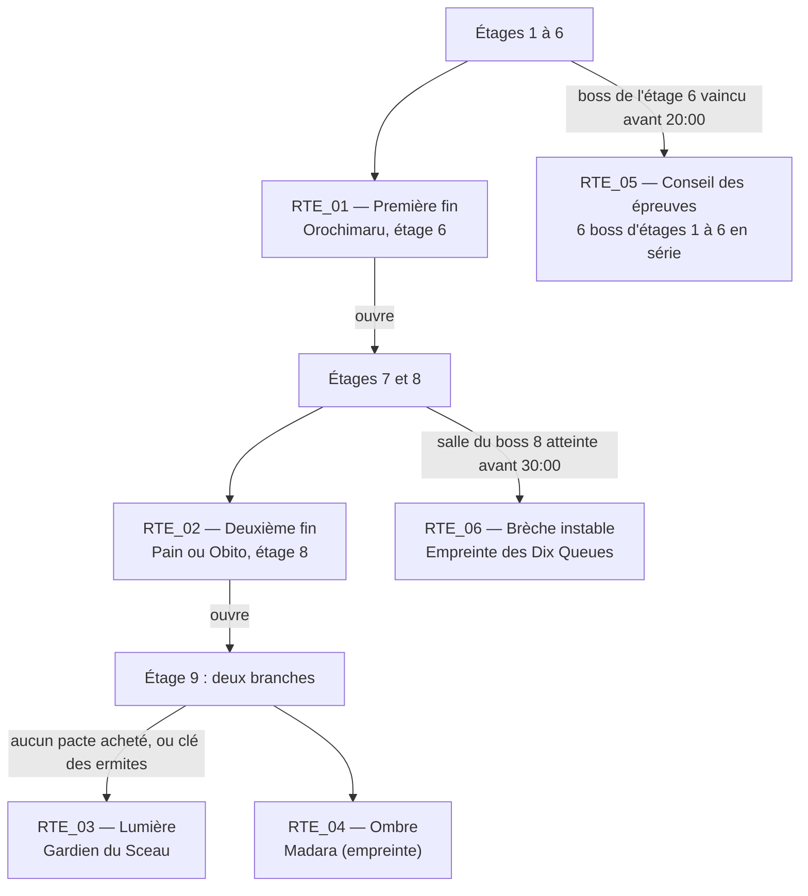

# E — Contenu jouable : roster, ennemis, boss, thèmes, routes, pactes, économie, secrets

> Partie rédigée de la section E. Les fiches exhaustives générées depuis les données (18 personnages, 24 boss attaque par attaque, 75 ennemis par fonction, 10 thèmes) sont dans [`E_fiches.md`](E_fiches.md) ; les catalogues complets dans [`F_catalogues.md`](F_catalogues.md).
> Tous les chiffres cités ici sont ceux du code (données v12). Ce sont des **valeurs de projet**, pas des mesures ni des transcriptions de Naruto ou d'Isaac. Les tests qui les vérifient sont nommés entre crochets, par exemple [pactes].

## Sommaire

1. [Roster : 12 personnages et 6 variantes](#e1-roster)
2. [Ennemis et champions](#e2-ennemis-et-champions)
3. [Boss : cadre commun et vue d'ensemble](#e3-boss)
4. [Thèmes : quatre fiches détaillées](#e4-thèmes)
5. [Routes, fins et graphe des dépendances](#e5-routes-et-fins)
6. [Pactes et sanctuaires : table de décision](#e6-pactes-et-sanctuaires)
7. [Économie : boutiques, informateurs, machines, sacrifice](#e7-économie)
8. [Secrets, objectifs et contrats](#e8-secrets-objectifs-et-contrats)

---

## E1. Roster

Le brief vise 40 personnages et 40 variantes ; la version jouable en contient **12 et 6** (écart assumé, voir I). Le choix couvre chaque famille de règle demandée au §25 plutôt que des visages : tir simple, tir chargé, corps-à-corps, soutien viable seul, marionnette émettrice, expert sans vitalité, expert économique.

| ID | Personnage | Santé de départ | Règle en une ligne | Diff. | Déblocage |
|---|---|---|---|---|---|
| CHR_001 | Naruto | 3 contenants | Obstination : +1 dégât à la dernière demi-unité, jusqu'à la fin de la salle | ★ | départ |
| CHR_002 | Sasuke | 3 contenants | Tir chargé libre ×0,5 à ×3 ; pleine charge : perce et enchaîne la foudre | ★★ | départ |
| CHR_003 | Sakura | 3 contenants | Soins excédentaires stockés (6 demis) qui renforcent Ōkashō | ★ | départ |
| CHR_004 | Kakashi | 3 contenants | Deux emplacements d'actif ; Pakkun signale les murs secrets | ★★ | vaincre Zabuza (OBJ_004) |
| CHR_005 | Rock Lee | 3 contenants | Mêlée en arc de 100° qui détruit les projectiles ordinaires | ★★ | vaincre Gaara (OBJ_009) |
| CHR_006 | Hinata | 3 contenants | Byakugan : plan et cache révélés ; paumes perçantes | ★ | 5 caches trouvées (OBJ_012) |
| CHR_007 | Shikamaru | 2 contenants + 2 demis de protection | Deux objets au choix en salle d'héritage ; kunai immobilisants | ★★ | 2 épreuves chūnin (OBJ_015) |
| CHR_008 | Gaara | 2 contenants + 4 demis de protection | Bouclier de sable : premier coup absorbé par salle ; lent (3,7 t/s) | ★★ | 3 réserves à la fois (OBJ_018) |
| CHR_009 | Kankurō | 3 contenants | Tirs émis par Karasu, qui bloque les projectiles | ★★ | 3 familiers à la fois (OBJ_021) |
| CHR_010 | Kiba | 3 contenants | Akamaru attaque et fouille (10 % de ressource par salle) | ★ | 30 salles avec familier (OBJ_024) |
| CHR_011 | Sasori (expert) | 6 demis de protection, aucune vitalité | Contenants convertis en réserve ; senbon empoisonnés | ★★★ | Sasori sans dégât (OBJ_027) |
| CHR_012 | Kakuzu (expert) | 2 contenants, 10 Ryō | Trois tirs en éventail ; blessé, les Ryō soignent ; pactes en Ryō | ★★★ | 50 Ryō à la fois (OBJ_030) |

### Variantes : une règle nouvelle, pas un multiplicateur

| Variante | Ce qui change réellement | Pourquoi ce n'est pas « plus fort » |
|---|---|---|
| ALT_001 Naruto — Réceptacle fissuré | Les clones deviennent une ressource : 4 au plus, 35 % des dégâts, un coup reçu retire un clone avant la santé ; une salle nettoyée en rend un | Un seul contenant ; sans clones, très exposé |
| ALT_002 Sasuke — Serment de vengeance | Chaque boss ouvre un pacte (jamais de sanctuaire), payé en chakra instable ; +0,5 dégât par pacte | Vitalité quasi nulle, aucun sanctuaire |
| ALT_003 Sakura — Sceau de la centaine | Plafond de deux contenants ; les soins en trop remplissent un sceau (12 demis) qui relève à la dernière demi-unité | Les pactes deviennent très chers |
| ALT_004 Gaara — Shukaku déchaîné | Tirs différés : le sable s'arrête à mi-course (12 grains) et converge au relâchement | Inefficace contre les cibles rapides |
| ALT_005 Kankurō — Trois marionnettes | Trois marionnettes échangeables (éventail, orbe immobilisant, bouclier frontal) | 0,5 s sans tir à chaque échange |
| ALT_006 Kakuzu — Cinq cœurs | À chaque étage, un passif est remplacé par un autre de même qualité ; 4 résurrections | Le build change sans cesse |

### Viabilité des experts (§25)

- **Sasori, sans vitalité rouge.** Les contenants gagnés deviennent 2 demis de protection ; la vitalité au sol est ignorée ; la source chaude rend 2 demis de protection en plus du soin ; les pactes se paient en réserves (`prixPacteDetail`) ; la récompense de boss est un cœur ou une protection à 50/50, donc utile une fois sur deux, ce qui est la contrepartie annoncée. Boutiques, machines, informateurs et boss restent utilisables.
- **Kakuzu, dépendant des Ryō.** Blessé, chaque Ryō ramassé soigne une demi-unité au lieu d'être gardé ; trois contenants au plus (un contenant de plus soigne) ; un pacte coûte 15 Ryō par contenant.
- **Soutien viable seul.** Hinata voit tout l'étage (économie de temps et de ressources) et perce ; Shikamaru choisit entre deux héritages et immobilise (15 % + 3 % par point de chance, 50 % au plus) ; Sakura transforme le soin en attaque sans soin gratuit infini (stock plafonné à 6 demis). Aucun ne reçoit « une explosion identique ».

## E2. Ennemis et champions

75 archétypes, 19 comportements (tableau complet dans E_fiches §3). Les onze fonctions du §26 sont toutes couvertes : poursuivant (11 archétypes), chargeur (7), tireur cardinal (3), tireur prédictif (4), lanceur en arc (3), protecteur (2), invocateur (6), poseur de pièges (4), guérisseur (3), embusqué (3), unité stationnaire (3 tourelles) ; s'y ajoutent volant, lourd, nuée, rampant, sauteur, kamikaze, errant et inerte.

**La difficulté vient des associations.** Chaque gabarit de salle place des *rôles* (lettres p, t, c, s, i, e, f, g, h, n, q, l, m, r, v) et chaque thème traduit un rôle en ennemis précis. Les associations difficiles sont donc écrites dans les gabarits, par exemple un protecteur (g) devant deux tireurs (t) : l'aura divise par deux les dégâts subis par ses voisins à moins de 2,5 tuiles, il faut le contourner ou le faire tomber d'abord ; un guérisseur (h) derrière un lourd (l) ; un invocateur (i) avec une nuée (n).

**Variété des salles.** 120 modèles, dont 90 salles de combat : 49 génériques 1×1, 20 propres à un thème, deux par thème (salle de classe et dojo de l'Académie ; racines et toiles géantes de la Forêt ; dunes et sables mouvants de Suna ; atelier encombré et chaîne de montage ; cuves et serpentarium d'Orochimaru ; canal à passerelles et écluse de Kiri ; antre aux braseros et salle du conseil de l'Akatsuki ; tranchées et cratères ; bassin et cascade des crapauds ; sceaux brisés et chaînes du sceau ; poids ×3 sur leur thème), 5 couloirs à portes imposées et 16 grandes salles (2×1 : 5, 1×2 : 4, 2×2 : 3, deux équerres par orientation). Les salles spéciales les plus fréquentes ont deux décors (échoppe, comptoir des dispositifs, bibliothèque, chambre forte, source). Un même étage ne répète pas un modèle tant qu'il en reste d'inédits.

### Champions : forme et icône, pas seulement une couleur

Probabilité par ennemi ordinaire : **5 %** (10 % en Difficile), **+2 %** à partir de l'étage 5. Chaque champion porte une aura de 4 pixels tournants **et** une icône au-dessus de la tête (lisible sans distinguer les teintes).

| Champion | Icône | Effet | Récompense |
|---|---|---|---|
| Rapide | vent | vitesse ×1,5, cadence ×1,3 | 1 Ryō |
| Robuste | bouclier | PV ×2,2, taille ×1,2, vitesse ×0,85, recul ×0,5 | 5 Ryō |
| Explosif | étoile | à sa mort, 8 projectiles en étoile | 1 explosif |
| Régénérant | feuille | +5 % PV/s après 2 s sans être touché | ½ cœur |
| Fantôme | spirale | intangible 1,2 s toutes les 4 s (dessiné à 40 %) | ½ protection |
| Diviseur | deux | à sa mort, deux copies à 45 % des PV (une génération) | 1 clé |
| Enragé | flamme | vitesse ×1,6 sous 50 % des PV | 1 Ryō |

## E3. Boss

24 boss produits (cible bibliothèque 70) : 19 d'étage (1 à 8), 2 de branche (étage 9), 1 de route chronométrée, 2 mini-boss de statues. Fiches complètes, attaque par attaque (zone, préparation, active, récupération, dégâts, réponse attendue), dans E_fiches §2.

**Cadre commun, lisible et sans triche.**

- Cycle par attaque : préparation visible et sonore (0,2 à 1,6 s), phase active, **récupération** (boss vulnérable), pause. Une seule attaque active par boss ; les duos et trios ont chacun leur cycle.
- Pas de répétition immédiate ; une *recharge* (s) impose un délai entre deux usages et une attaque peut s'épuiser (Kabuto : soin trois fois au plus, espacé de 10 s ; invocation toutes les 8 s au plus).
- Invulnérabilité courte et montrée par un anneau : 0,6 s (rupture d'Hiruko), 0,8 s (mue d'Orochimaru).
- Résistances visibles et expliquées : Kakuzu durci ×0,3 pendant 1,8 s (peau grise) ; Hiruko ×0,5 jusqu'à 55 % (teinte brune) ; Susanoo d'Itachi : bouclier frontal seulement, contournable, 2,5 s de brèche toutes les 6,5 s.
- Aucune attaque n'exige un objet : tout s'esquive à la vitesse de base (4,5 t/s) et se gagne avec le tir de départ.
- **Géants** : le contact est un cercle de rayon *r* (Dix Queues : 26 px) et non le rectangle du sprite ; le corps du serpent géant blesse par 6 cercles de 10 px, tous dessinés.

**Styles des boss terminaux** (le brief refuse une sphère centrale partout) :

| Boss | Style | Ce qui est lu |
|---|---|---|
| BOS_014 Orochimaru (fin 1) | danger qui se multiplie | mues hostiles, réapparition ailleurs, huit lignes de serpents |
| BOS_018 Pain (fin 2) | forces de terrain | répulsion qui efface vos tirs, attraction, noyau à détruire |
| BOS_019 Obito (fin 2) | épreuve de lecture | présence intermittente : il n'est frappable que pendant ses attaques |
| BOS_020 Gardien du Sceau (Lumière) | arène évolutive | blocs redistribués à 66 % et 33 % |
| BOS_021 Madara (Ombre) | attaques massives | météore à fuir, dragons qui brisent la couverture, grands balayages |
| BOS_022 Dix Queues (Brèche) | géant immobile | queues en arcs annoncés, rayon, anneaux à brèche |
| BOS_007 Trio du Son (étage 3) | plusieurs cibles | trois rôles distincts, la salle finit quand les trois tombent |

**Mesures** [boss] : avec un tir renforcé (deux Kunai lestés, +2 dégâts, et la Pilule du soldat, +0,5 tir/s) et un robot de test invulnérable, chaque boss meurt en 10 à 98 s selon les parties (Kabuto 37 à 57 s sur dix essais après équilibrage). Ce test prouve que chaque combat se termine ; il **ne prouve pas** qu'un humain esquive tout à la vitesse minimale : cette propriété est garantie par construction (une attaque à la fois, brèches d'au moins 1,5 projectile, préavis ≥ 0,2 s) et reste à confirmer en recette manette (H §6).

## E4. Thèmes

Dix thèmes et dix-huit variantes (fiches générées dans E_fiches §4). Chaque variante change **une règle**, pas seulement l'apparence. Quatre fiches développées :

### THM_ACA — Sous-sols de l'Académie (chapitre I)

- **Identité** : planches et briques, lumière chaude, cibles d'entraînement, parchemins, lanternes ; musique en gamme *yo*, 88 bpm, koto.
- **Variantes** : *Salles d'entraînement* (jarres et caisses fréquentes : plus de ressources cachées, moins de couverture solide) ; *Archives inondées* (flaques qui ralentissent la marche, pas le vol).
- **Ennemis** : poupées animées, genin renégats, tireurs cardinaux, chauves-souris, instructeur déchu (invocateur).
- **Boss** : Mizuki (éventail, grand shuriken revenant, charges), Serpent géant (corps segmenté), Frères démons (chaîne qui se tend).
- **Rôle dans la partie** : apprendre le tir cardinal, la lecture des télégraphes et les secrets de base.

### THM_SUN — Cavernes de Suna (chapitre II)

- **Identité** : sable, roche, jarres de sable, cristaux ; gamme *ryūkyū*, 92 bpm.
- **Variantes** : *Grottes de sable* (sables mouvants qui aspirent) ; *Galeries de verre* (blocs de cristal sur lesquels les tirs rebondissent trois fois au plus [mecaniques]).
- **Ennemis** : scorpions, momies lourdes, esprits de sable, poseurs de sceaux de sable.
- **Boss** : Gaara (cercueil, vagues à brèche, pluie ; sous 50 %, la bande de sable se referme sur l'arène [mecaniques]).
- **Rôle** : la position compte (sables, rebonds), premières zones persistantes.

### THM_ORO — Laboratoires d'Orochimaru (chapitre III)

- **Identité** : cuves, dalles froides, lumière verdâtre ; statue du serpent (pacte).
- **Variantes** : *Salle des cuves* (flaques d'acide) ; *Serpentarium* (nids de serpenteaux).
- **Ennemis** : sujets expérimentaux, serpents blancs chargeurs, tireurs du Son, poseurs de parchemins explosifs.
- **Boss** : Kabuto (soin interruptible, sujets réanimés), Orochimaru (mues).
- **Rôle** : gestion des invocations et des dégâts de zone ; les pactes deviennent tentants.

### THM_AKA — Repaires de l'Akatsuki (chapitre IV)

- **Identité** : grottes de scellement, pluie d'Ame, nuages rouges.
- **Variantes** : *Grotte du scellement* (pénombre 55 % : lanternes et feu éclairent, les dangers restent contourés) ; *Tour d'Ame* (pluie, renforts de Zetsu).
- **Boss** : Deidara (C3 : se cacher derrière un bloc), Itachi (illusions sans ombre, Susanoo frontal), Kakuzu (masques, peau durcie), Pain, Obito.
- **Rôle** : lecture sous contrainte visuelle, combats de fin de partie.

## E5. Routes et fins

| Route | Bifurcation | Prérequis (coût) | Indice en jeu | Récompense de première victoire | Marque |
|---|---|---|---|---|---|
| RTE_01 Première fin | étage 6 | aucun | toujours ouverte | étages 7-8 ; Mue du serpent, Rituel de permutation | Serpent |
| RTE_02 Deuxième fin | étage 8 | RTE_01 | « le labyrinthe s'approfondit » | branches de l'étage 9 ; Sceau de la mort, Transfert d'esprit | Nuage rouge |
| RTE_03 Lumière | après le boss 8 | RTE_02 ; **renoncer** à tout pacte (ou deux gardiens de sanctuaire vaincus) | « un rayon ne s'ouvre qu'à ceux qui n'ont rien vendu d'eux-mêmes » | Nature du sage, Sceau de scellement | Crapaud |
| RTE_04 Ombre | après le boss 8 | RTE_02 | « la trappe mène plus bas » | Réincarnation impure, Espace-temps intangible | Éventail |
| RTE_05 Conseil (Boss Rush) | étage 6 | chronomètre < 20:00 | « les juges n'attendent pas les retardataires » | défis DEF_010 et DEF_011 | Parchemin d'or |
| RTE_06 Brèche | étage 8 | chronomètre < 30:00 à l'entrée du boss | « une fissure respire… si l'on arrive tôt » | Chute céleste | Dix queues |

**Vérifications du graphe.** Aucune route n'exige un objet qu'elle seule débloque : la clé des ermites (PSV_900) s'obtient avant RTE_03, par les statues de sanctuaire ; RTE_05 et RTE_06 ne demandent aucun déblocage, seulement le chronomètre (arrêté en pause et sur les écrans de décision). Les fragments de la clé s'obtiennent dans l'ordre (premier gardien : fragment, second : clé). Les cas limites du §27 : le vol ignore les coûts de passage mais ne saute aucune porte de route ; un personnage sans vitalité peut prendre toutes les routes (RTE_03 regarde les pactes achetés, pas la santé) ; une relance générale ne détruit pas les objets-clés (PSV_900/901 hors pools). **Non produit** : la remontée secrète (A, matrice).

Chaque fin affiche un texte original du labyrinthe (`TEXTES_FINS`) et ouvre un palier ; la marque est inscrite par personnage dans le Registre.

## E6. Pactes et sanctuaires

Deux logiques concurrentes : la puissance immédiate payée en santé (pacte), et le renoncement qui ouvre des récompenses gratuites mais incertaines (sanctuaire). Aucune n'est meilleure partout : le pacte ferme le sanctuaire pour toute la partie et la branche de la Lumière ; le sanctuaire ne donne qu'un objet, parfois un choix exclusif.

### Table de décision (après le boss d'un étage 2 à 8)

**1. Probabilité d'une opportunité** *c* (bornée à 95 %) :

| Condition | Apport |
|---|---|
| base | +20 % |
| aucune perte de **vitalité** sur l'étage | +15 % |
| aucun coup reçu dans la salle du boss | +10 % |
| Bague de l'organisation (TAL_015) | +5 % |
| Sceau maudit (PSV_091) | +20 % |
| faveur de l'autel (palier 6 du tribut) | +30 % |
| étage 1 ou 9 | aucune opportunité |

**2. Choix du type** (poids renormalisés) : pacte 0,6 ; sanctuaire 0,4 + 0,25 par pacte **refusé** + 0,15 avec le talisman TAL_004. **Un pacte acheté** met le poids du sanctuaire à 0 pour la partie. Le Serment de vengeance (ALT_002, DEF_008) force un pacte à 100 %.

**3. Tirage** : un seul tirage par étage, graine `code | opportunite | étage` : recharger, quitter ou revenir ne change pas le résultat [pactes].

**4. Contenu** : pacte, 1 à 3 objets du pool *pacte*, 1 contenant (qualité ≤ 2) ou 2 (qualité ≥ 3) ; sans aucun contenant, 4 demis de protection par contenant dû (Kakuzu : 15 Ryō par contenant ; Serment : 3 demis de chakra instable) ; le résultat exact s'affiche avant confirmation, et un paiement mortel demande une seconde confirmation. Sanctuaire, 1 objet gratuit (ou 2 au choix exclusif, 40 %), statue du crapaud qu'un explosif réveille (mini-boss, fragment de clé).

### Événements et effet sur l'évaluation (vérifiés par [pactes])

| Événement | Effet |
|---|---|
| dégât ennemi qui entame la vitalité | perd le +15 % de l'étage |
| dégât **absorbé par une protection** | ne compte pas pour la vitalité ; dans la salle du boss, perd le +10 % |
| prix payé (pacte, don vital, passage maudit) | ne compte pas (c'est un prix, pas un dommage) |
| sacrifice à l'autel | ne compte pas |
| explosion de votre propre explosif | compte comme un dégât (vitalité si elle est touchée) |
| soin | n'efface pas un dégât déjà subi |
| visite d'un pacte **sans achat** puis départ de l'étage | +1 refus (+0,25 au poids du sanctuaire), secret SEC_012 |
| achat d'un pacte | poids du sanctuaire à 0 pour la partie ; ferme la Lumière (sauf clé des ermites) |

Les chances à jour s'affichent dans l'écran de pause : total, part du pacte et du sanctuaire, détail des apports.

### Scénarios chiffrés

| # | Situation | Opportunité | Pacte | Sanctuaire |
|---|---|---|---|---|
| A | touché partout (vitalité et boss) | 20 % | 12 % | 8 % |
| B | seule la protection entamée, mais touché au boss | 35 % | 21 % | 14 % |
| C | étage sans aucun coup | 45 % | 27 % | 18 % |
| D | C + un pacte refusé plus tôt | 45 % | 21,6 % | 23,4 % |
| E | C + un pacte déjà conclu | 45 % | 45 % | 0 % |
| F | Sceau maudit + faveur de l'autel, sans coup | 95 % (plafond) | 57 % | 38 % |
| G | vitalité entamée, boss propre, TAL_004 + deux refus | 30 % | 10,9 % | 19,1 % |
| H | Serment de vengeance | 100 % | 100 % | 0 % |

## E7. Économie

**Boutique.** Prix de référence : objet de qualité 0-1 : 10 Ryō, 2 : 15, 3 : 20, 4 : 25 ; cœur 3, pilule 4, clé, explosif, rouleau ou protection 5, condensateur 6. Deux objets en vitrine (trois avec PSV_124), le reste en ressources ; chaque étal a 10 % de chances d'être soldé (moitié, arrondi au-dessus), +4 % par niveau d'échoppe. Pas de renouvellement dans l'étage : seules les relances d'actif changent la vitrine. Soldes (objet) : tous les prix ×0,5 ; coupon : premier achat de l'étage gratuit.

**Progression de l'échoppe.** Le tanuki de chaque boutique accepte des offrandes d'un Ryō ; le cumul est inscrit au profil. Paliers 50 / 150 / 300 : soldes plus fréquentes à chaque niveau, puis un objet de plus en vitrine dès le niveau 2. De la variété et des occasions, jamais une hausse de statistiques [economie]. Un explosif sur la statue libère 3 à 6 Ryō une fois, et ferme les offrandes de l'étage (SEC_014).

**Informateurs** (probabilités fixes et publiques, tirées du flux de l'étage) :

| Informateur | Coût par paiement | Issues | Après paiement |
|---|---|---|---|
| Voyageur | 1 Ryō | 12 % objet (pool machine) ; sinon 20 % petit présent | part après l'objet |
| Receleur de clés | 1 clé | 20 % coffre verrouillé ; 10 % talisman | reste |
| Artificier | 1 explosif | 25 % explosifs ×2 ; 5 % objet | part après l'objet |

**Machines.** Loterie (1 Ryō) : 62 % rien, 18 % 2 Ryō, 8 % clé, explosif ou cœur, 7 % pilule, 3,5 % 5 Ryō, 1,5 % objet (la machine se brise) ; le Jeton de tripot (TAL_022) ramène le « rien » à 56 %, les Dés de la grande perdante (PSV_125) doublent chaque gain. Don vital : ½ unité (prix) contre 1 à 3 Ryō, bloqué après 6 dons, confirmation si mortel. Diseuse (1 Ryō) : 50 % indice, 30 % protection, 15 % talisman, 5 % deux rouleaux. Soin : 3 Ryō, ½ cœur, refusé à santé pleine. Recharge : 5 Ryō, 2 charges. Troc : poche contre talisman, ou talisman contre rouleau et pilule. Un explosif détruit une machine : 2 à 4 Ryō ou demi-cœurs, une fois (SEC_013) ; pas de blocage aléatoire caché.

**Autel de tribut** (salle de sacrifice). Chaque passage coûte ½ unité (sacrifice, pas un dommage : ni évaluation de pacte, ni passif « blessé »), protection d'abord. Paliers stockés et tirés avec une graine par étage et par palier, donc sans relance possible :

| Palier | 1 | 2 | 3 | 4 | 5 | 6 | 7 | 8 | 9 | 10 | 11 | 12 |
|---|---|---|---|---|---|---|---|---|---|---|---|---|
| Chance | 50 % | 50 % | 67 % | 50 % | 33 % | 100 % | 33 % | 100 % | 50 % | 100 % | 100 % | — |
| Récompense | Ryō | Ryō | coffre | protection | objet du sanctuaire | faveur (+30 % d'opportunité) | objet du sanctuaire | 5 Ryō | 2 protections | coffre verrouillé | objet de pacte + cicatrice | rassasié |

Une mort pendant le paiement passe par les résurrections dans l'ordre (cœur de réserve, cœur volé), puis la mort.

**Chambre maudite** : ½ unité à l'entrée et à la sortie (prix affiché), sauf en vol ; coffres piégés ; si le gabarit ne prévoit pas d'ennemis, 40 % de chances de deux gardiens. **Source chaude** : 5 Ryō ou 1 clé, soin de 4 demis (et 2 demis de protection sans vitalité), une fois.

### Cinq parties sauvées par l'économie plutôt que par un objet de dégâts

1. **Les clés du receleur.** Trois clés sans coffre à ouvrir deviennent un coffre verrouillé et un talisman : la Bague de l'organisation (+5 % d'opportunité) fait basculer l'étage suivant dans le pacte voulu.
2. **Le tribut patient.** Six passages à l'autel sur un étage propre (3 unités) donnent la faveur (+30 %) : avec un étage sans coup, l'opportunité passe de 45 % à 75 % et le sanctuaire garde 30 % pour lui.
3. **La loterie outillée.** Avec les Dés de la grande perdante, la loterie rend en moyenne 1,07 Ryō par Ryō misé, sans compter clés, cœurs, pilules et objets ; les Ryō paient la recharge d'un actif lourd (5 Ryō pour 2 charges) juste avant un boss.
4. **Refuser pour ouvrir.** Un pacte médiocre refusé à l'étage 3 fait passer la part du sanctuaire de 40 % à 52 % des opportunités suivantes, et garde la branche de la Lumière ouverte.
5. **Kakuzu soigné par la fortune.** Les jarres et les rochers à sceau donnent des Ryō qui soignent Kakuzu blessé : une salle de ressources vaut un soin, et la boutique vend la protection qui manque.

## E8. Secrets, objectifs et contrats

**Secrets (15).** Chaque secret a un **indice consultable en jeu** : Registre des missions, onglet *Secrets* ; la solution s'y inscrit quand le secret est trouvé, avec une notification la première fois. Liste complète dans F. Des indices supplémentaires viennent de la diseuse et des chiens de Kakashi (Pakkun signale un mur secret).

**Objectifs (60).** 23 défaites de boss (dont une sans dégât), 22 fins (par route, personnage, difficulté ou contrat), 11 compteurs cumulés, 4 états simultanés (3 réserves, 3 familiers, 50 Ryō, 12 objets). Le premier palier se débloque sans aucun objet nouveau : vaincre Zabuza donne Kakashi.

**Contrats (12)**, tous vérifiés par [defis] :

| Contrat | Règle | Réussite |
|---|---|---|
| DEF_001 Taijutsu pur | Rock Lee imposé, aucune salle d'héritage | première fin |
| DEF_002 Nuit sans lune | pénombre 55 % à tous les étages | première fin |
| DEF_003 Mains vides | aucune salle d'héritage | première fin |
| DEF_004 Un souffle | un seul contenant, jamais plus | première fin |
| DEF_005 Artificier | départ avec deux objets d'argile | première fin |
| DEF_006 Mille clones | Naruto, deux Clones de l'ombre, dégâts ×0,7 | première fin |
| DEF_007 Tout s'achète | 50 Ryō, Carte de membre, aucun héritage | première fin |
| DEF_008 Sang pour sang | chaque boss ouvre un pacte | première fin |
| DEF_009 Tempête du désert | Gaara, deux objets de sable | première fin |
| DEF_010 Course de l'examen | — | première fin **en moins de 20:00** |
| DEF_011 Collectionneur pressé | — | arriver à l'étage 6 avec **10 passifs** (dès l'arrivée) |
| DEF_012 Examen de jōnin | Difficile imposé, une épreuve par étage, épreuves de boss aux étages 4, 6, 8 | première fin |

Un contrat n'est inscrit que si ses conditions sont tenues ; l'écran de victoire dit s'il est rempli. Les modes Standard, Difficile, contrats, mission à code et Conseil (Boss Rush) sont jouables ; le **Marché des mercenaires** (mode de vagues économique) n'est pas produit (voir I).
