# G — Builds, trois parties commentées, seize briefs d'écrans

> Section G du dossier. Les objets, synergies et transformations cités existent tous dans les données du jeu (tables complètes dans [F_catalogues.md](F_catalogues.md)). Les parties commentées s'appuient sur des **missions à code réelles**, rejouables, dont les journaux bruts sont dans [G_journaux.md](G_journaux.md). Les captures des briefs sont prises dans le jeu (`dossier/images/`, 640×360, taille native).

## Sommaire

1. [Builds : adaptation au hasard, pas recettes](#g1-builds)
2. [Trois parties commentées](#g2-trois-parties-commentées)
3. [Seize briefs d'écrans](#g3-seize-briefs-décrans)

---

## G1. Builds

### Principes

- Un build est une **direction** que l'on prend quand le labyrinthe l'offre, pas une liste d'achats. Le **noyau** (3 à 6 objets) n'est pas une limite d'inventaire : tout le reste s'ajoute.
- **Obtenabilité.** Les pools ne se valent pas (héritage 145 objets, boutique 68, boss 55, pacte 44, bibliothèque 39, sanctuaire 27, cache 9, isolée 3) et les objets de qualité 3-4 sont rares. Un noyau qui exige plusieurs objets de qualité 4 du même pool est marqué *exceptionnel*.
- **Formes de tir.** Une seule forme est principale (priorité `frappe > contrôle > rayon > faisceau > orbe > charge libre > lame longue > lame > bombe > boomerang > laser > rotation > projectile`) ; les autres deviennent des contributions (C §2). Rock Lee garde toujours la mêlée : ses formes de tir sont converties.
- **Transformations** : trois identifiants distincts acquis d'un même ensemble (C §9).

Légende des catégories : **[P]** partiel mais capable de gagner avec 2-3 objets communs · **[R]** puissant, avec un risque réel · **[E]** économique ou utilitaire · **[F]** fondé sur un objet peu attirant · **[O]** direction ordinaire.

Répartition : 12 [P], 12 [R], 12 [E], 6 [F], 22 [O] — 64 builds couvrant les 18 entrées jouables (3 directions chacune, reprises des fiches E) et 10 builds transverses.

### Naruto (CHR_001)

**BLD_01 · Armée de l'ombre** [O] — Noyau : ACT_002 Multi-clonage (départ), PSV_061 Clone de l'ombre, **PSV_023 Clone de relais** (pivot, copie 75 % de vos tirs), PSV_151 Chakra partagé. Avant le pivot : cadence (PSV_036) ou dédoublement (PSV_002, qui déclenche SYN_021 *Clones à l'encre* avec PSV_061). Transformation visée : Meute d'invocation (TRF_011, trois objets de la meute : PSV_061, PSV_151 et un chien ou Gamakichi). Force : couverture, dégâts répartis. Faiblesse : les clones répètent vos angles morts ; peu de réponse aux protecteurs de face. Route : RTE_01-02.

**BLD_02 · Orbe spiralé** [O] — Noyau : **PSV_001 Empreinte du Rasengan** (pivot), PSV_002 (SYN_001 *Rasengan jumeau*), PSV_028 Chidori nagashi (SYN_003 *Sphère orageuse*). Compléments : PSV_055 Chakra du renard et PSV_046 Lame de vent (ensemble renard, TRF_001 *Manteau du renard*) ; PSV_146 Rasenshuriken (SYN_004) est exceptionnel (qualité 4). Jeu : charger à couvert, relâcher sur les groupes. Faiblesse : temps de charge contre les poursuivants rapides.

**BLD_03 · Vent tranchant** [P] — Noyau : **PSV_046 Lame de vent** (perce, portée), PSV_031 Kunai du vent, PSV_155 Shuriken de papier. Trois objets communs suffisent pour tenir jusqu'à la première fin ; PSV_031 et PSV_046 comptent déjà pour l'ensemble renard. Faiblesse : dégâts bruts modestes contre les boss lourds.

### Sasuke (CHR_002)

**BLD_04 · Foudre en chaîne** [O] — Noyau : **PSV_028** (pivot), PSV_045 Courant foudroyant, PSV_147 Lance de foudre, PSV_058 Armure de foudre → TRF_008 *Outils du tonnerre*. La pleine charge de Sasuke enchaîne déjà la foudre : chaque objet ajoute des sauts. Force : salles pleines. Faiblesse : les boss seuls profitent peu des chaînes.

**BLD_05 · Canon condamné** [R] — Noyau : **PSV_014 Canon de chakra** (qualité 4), PSV_008 Senbon perforant (SYN_006 *Rayon perçant*), PSV_131 Sceau de la mort (SYN_056 : dégâts ×2, deux contenants en moins). Exceptionnel (deux qualité 4). Le rayon devient la forme principale (il se charge déjà) ; la charge libre de Sasuke passe en contribution. Risque : à deux contenants, le Sceau de la mort ne laisse qu'une réserve.

**BLD_06 · Frappe éclair** [P] — Noyau : ACT_003 Chidori (départ, 6× dégâts en ligne, invulnérable pendant la ruée), PSV_088 Cape de chakra protecteur, PSV_035 Sandales de course. Le Chidori traverse les charges des boss : on l'emploie comme esquive offensive. Faiblesse : recharge de l'actif.

### Sakura (CHR_003)

**BLD_07 · Réserve de soins** [E] — Noyau : PSV_093 Chakra de la limace, **PSV_087 Sceau de régénération** (SYN_048 *Réserve inépuisable*), PSV_063 Katsuyu miniature. Les soins en trop alimentent Ōkashō (6 demis stockés au plus). Force : longues parties sans boutique. Faiblesse : lente contre les boss à fort volume.

**BLD_08 · Poing fermé** [P] — Noyau : PSV_040 Gants de taijutsu, PSV_047 Poing de terre, PSV_034 Kunai lestés. Trois objets de statistiques renforcent son tir court et Ōkashō. Faiblesse : portée courte (4,5 tuiles).

**BLD_09 · Gardienne des sanctuaires** [E] — Noyau : TAL_013 Charme du plein (+0,5 dégât à vitalité pleine), TAL_004 Perles du moine (+0,15 au poids du sanctuaire), **refus systématique des pactes**. Vise la branche de la Lumière (RTE_03). Chaque pacte refusé ajoute +0,25 au poids du sanctuaire.

### Kakashi (CHR_004)

**BLD_10 · Double actif** [E] — Noyau : ACT_001 Réécriture d'empreinte, un actif offensif lourd (ACT_016 Grand crapaud ou ACT_024 Rasenshuriken), PSV_127 Sceau de réécriture (SYN_046 *Économie de relance*), TAL_003 Pile de chakra. Les deux emplacements d'actif font de Kakashi un gestionnaire de charges. Faiblesse : statistiques moyennes.

**BLD_11 · Lame de foudre** [O] — Noyau : ACT_003 Chidori dans le second emplacement, PSV_028, PSV_045. Le chien Pakkun de départ reste utile (secrets).

**BLD_12 · Chasseur de secrets** [E] — Noyau : PSV_068 Pakkun (départ), PSV_113 Byakugan, PSV_106 Épingle de crochetage, PSV_099 Sac de parchemins. Toutes les caches, isolées et coffres de l'étage, sans dépendre des clés.

### Rock Lee (CHR_005)

**BLD_13 · Huit Portes** [R] — Noyau : ACT_007 Porte de l'Ouverture (départ), **PSV_092 Porte de la Vie** (−1 contenant), PSV_041 Cadence de la fleur de lotus, PSV_040 Gants de taijutsu → TRF_012 *Huit Portes* ; ACT_030 Lotus primaire (SYN_053, coûte ½ unité). Risque : santé réduite pour un personnage au contact.

**BLD_14 · Grand sabre** [O] — Noyau : **PSV_017 Kubikiribōchō** (lame longue : arc 140°, 2,6 tuiles), PSV_136 Écailles de Samehada (SYN_024 *Grand sabre vorace*, soin toutes les 12 éliminations). La lame longue reste une mêlée : Lee la garde comme forme principale.

**BLD_15 · Contre-attaque** [P] — Noyau : PSV_088 Cape de chakra protecteur, PSV_054 Marque de Jashin (blessé : 15 dégâts à tous), PSV_056 Bulle de chakra rouge (blessé : 8 tirs). Chaque coup reçu au contact devient une riposte.

### Hinata (CHR_006)

**BLD_16 · Percement multiple** [O] — Noyau : PSV_003 Éventail de kunai, PSV_004 Mille aiguilles, PSV_024 Arsenal de Tenten (SYN_055 *Arsenal complet*). Ses paumes percent déjà : chaque projectile supplémentaire touche plusieurs ennemis.

**BLD_17 · Défense absolue** [O] — Noyau : ACT_008 Huit trigrammes (départ), PSV_022 Rotation céleste, PSV_081 Miroirs de glace (SYN_041), PSV_113 Byakugan (SYN_026) → TRF_005 *Résonance des yeux*. Force : projectiles ennemis neutralisés. Faiblesse : dégâts faibles.

**BLD_18 · Exploratrice** [E] — Noyau : PSV_111 Carte, PSV_112 Boussole, PSV_115 Lévitation (ignore fosses et passages maudits), PSV_118 Grelot. Chaque salle utile visitée, aucun coût de chambre maudite.

### Shikamaru (CHR_007)

**BLD_19 · Ombre lestée** [P] — Noyau : ACT_009 Manipulation des ombres (départ), PSV_051 Ombre liante, PSV_034 Kunai lestés (SYN_020). Sa règle immobilise déjà (15 % + 3 %/chance) : deux objets suffisent pour contrôler les salles.

**BLD_20 · Stratège des pools** [E] — Noyau : double héritage (règle), PSV_127 Sceau de réécriture, ACT_001 Réécriture, PSV_124 Réputation de client. On choisit au lieu de subir.

**BLD_21 · Terrain miné** [O] — Noyau : PSV_027 Parchemins-pièges, PSV_030 Shuriken démultiplié (SYN_038 *Mines éclatantes*), PSV_156 Mer de papiers explosifs, PSV_115 Lévitation (SYN_051). Les bombes de papier tiennent les couloirs.

### Gaara (CHR_008)

**BLD_22 · Armure de sable** [O] — Noyau : PSV_010 Sable en orbite, PSV_065 Sable protecteur (SYN_013 *Tempête orbitale*), PSV_097 Armure de sable absolue → TRF_006. Force : tank. Faiblesse : lenteur (3,7 t/s).

**BLD_23 · Désert gelé** [R] — Noyau : **PSV_020 Chute céleste** (qualité 4, forme frappe), PSV_050 Glace éternelle (SYN_010 *Météore gelé*). Exceptionnel. Risque : la frappe demande de viser un point ; Gaara, lent, doit anticiper.

**BLD_24 · Muraille** [P] — Noyau : PSV_088 Cape, TAL_007 Talisman de protection, PSV_096 Substitution instinctive. Avec son bouclier de sable, chaque salle commence par un coup gratuit.

### Kankurō (CHR_009)

**BLD_25 · Arsenal du marionnettiste** [O] — Noyau : PSV_072 Karasu, PSV_073 Kuroari, PSV_074 Sanshōuo (+ PSV_048) → TRF_004. Karasu de départ tire ; les marionnettes ajoutées frappent, piègent et protègent.

**BLD_26 · Venin** [P] — Noyau : PSV_048 Poison de scorpion, PSV_142 Main du scorpion, PSV_004 Mille aiguilles (SYN_015). Ses lames empoisonnent déjà : le poison double de durée et se multiplie.

**BLD_27 · Familiers tireurs** [O] — Noyau : PSV_061, PSV_023, PSV_151, PSV_077 Clone de sable. Le point d'émission décalé de Kankurō se combine avec des tireurs autonomes.

### Kiba (CHR_010)

**BLD_28 · Meute d'invocation** [O] — Noyau : PSV_068 Pakkun, PSV_069 Petit chien (SYN_022 *Flair de la meute*), PSV_076 Tigres d'encre, PSV_151 → TRF_011.

**BLD_29 · Crocs rapides** [P] — Noyau : ACT_012 Crocs sur crocs (départ), PSV_035 Sandales, PSV_058 Armure de foudre. Vitesse et passes en vrille.

**BLD_30 · Essaim collecteur** [E] — Noyau : **PSV_070 Kikaichū** (ramasse les pièces et pique), PSV_108 Aimant, PSV_107 Bourse-grenouille, PSV_123 Livret d'épargne. Akamaru fouille (10 %), l'essaim ramasse : l'économie tourne seule.

### Sasori (CHR_011, sans vitalité)

**BLD_31 · Corps sans cœur** [R] — Noyau : PSV_088 Cape, TAL_007, **PSV_143 Mue du serpent** (une réserve regagnée par étage à la dernière rupture), PSV_089 Cœur volé (se relève avec une réserve). Risque : aucun soin de vitalité ; chaque contrepartie « −1 contenant » coûte 4 demis de réserve.

**BLD_32 · Poison et marionnettes** [O] — Noyau : PSV_048, PSV_142, PSV_072. Senbon empoisonnés (35 %) plus poison objet.

**BLD_33 · Pactes payés en réserves** [R] — Noyau : PSV_091 Sceau maudit (deux réserves instables, pactes plus fréquents), PSV_139 Transfert du pacte (+1 dégât par pacte), PSV_135 Rituel du sang. Chaque pacte coûte 4 demis de réserve par contenant.

### Kakuzu (CHR_012)

**BLD_34 · Boutique et relances** [E] — Noyau : PSV_121 Carte de membre, PSV_124 (SYN_045 *Marchand avisé*), PSV_127, ACT_001. Les prix divisés par deux et un étal de plus.

**BLD_35 · Tripot** [E] — Noyau : PSV_125 Dés de la grande perdante, TAL_022 Jeton de tripot, PSV_105 Trousseau du geôlier, PSV_070. La loterie rend alors plus qu'elle ne coûte (E §7) ; les Ryō soignent Kakuzu blessé.

**BLD_36 · Éventail élémentaire** [O] — Noyau : trois tirs de départ, PSV_043 Grande boule de feu, PSV_046 Lame de vent (SYN_017 *Le vent attise le feu*), PSV_003 (SYN_016).

### Variantes altérées

**BLD_37 · Armée permanente** [O] (ALT_001) — Clones-ressource (4), PSV_151, PSV_061, PSV_023.
**BLD_38 · Relais explosif** [R] (ALT_001) — ACT_050 Relais (sacrifie un clone : explosion 5×), PSV_149 Explosion de chakra, PSV_110 Argile infinie. Risque : un clone sacrifié ne protège plus.
**BLD_39 · Protection par le nombre** [P] (ALT_001) — PSV_096 Substitution, PSV_080 Poupée d'entraînement (SYN_050). Les coups se perdent entre bûches, poupée et clones.
**BLD_40 · Collection de pactes** [R] (ALT_002) — PSV_139, PSV_091, PSV_135 ; +0,5 dégât par pacte (règle). Tout se paie en chakra instable.
**BLD_41 · Chakra démoniaque** [R] (ALT_002) — PSV_098, PSV_134 Colère de la Racine, PSV_056 (SYN_049).
**BLD_42 · Charge démesurée** [O] (ALT_002) — PSV_146 Rasenshuriken (orbes et charges explosent), PSV_012 Baika.
**BLD_43 · Sceau inépuisable** [E] (ALT_003) — PSV_093, PSV_087, PSV_063 : le sceau (12 demis) ne se vide jamais.
**BLD_44 · Voie des ermites** [E] (ALT_003) — TAL_004, TAL_013, sanctuaires ; plafond de deux contenants : les pactes sont hors de prix.
**BLD_45 · Ōkashō chargé** [P] (ALT_003) — ACT_004 (départ), TAL_003 Pile de chakra, PSV_040.
**BLD_46 · Nuage de sable** [O] (ALT_004) — PSV_150 Tempête de sable, PSV_010, PSV_065 (SYN_042 *Coups de sable*).
**BLD_47 · Pièges suspendus** [O] (ALT_004) — PSV_027 : les grains suspendus deviennent des mines au relâchement.
**BLD_48 · Explosion de grains** [R] (ALT_004) — PSV_149, PSV_030 : chaque grain convergent éclate. Risque : tout se joue au relâchement.
**BLD_49 · Rotation des trois** [O] (ALT_005) — trois marionnettes de départ, PSV_048, PSV_142.
**BLD_50 · Bouclier permanent** [P] (ALT_005) — Sanshōuo (règle) et PSV_065 Sable protecteur.
**BLD_51 · Capture empoisonnée** [O] (ALT_005) — Kuroari (règle), PSV_048, PSV_051.
**BLD_52 · Adaptation permanente** [R] (ALT_006) — aucun noyau fixe : on joue ce que la reconstruction d'inventaire donne ; PSV_089 comme filet.
**BLD_53 · Qualité élevée** [E] (ALT_006) — PSV_127, ACT_001, PSV_126 Livre de l'ermite.
**BLD_54 · Cinq vies** [R] (ALT_006) — quatre cœurs de réserve (règle), PSV_089, PSV_143.

### Builds transverses

**BLD_55 · Croix de foudre** [F] — PSV_025 Œil arrière (seul, peu attirant), PSV_026 Croix de sceaux, PSV_028 (SYN_037) : les tirs arrière et en croix deviennent des relais de foudre.
**BLD_56 · Faisceau ondulant** [F] — PSV_011 Onde de la vague (précision moindre), PSV_016 Souffle continu (SYN_030) : l'onde élargit un faisceau qui ne rate plus.
**BLD_57 · Bûche et appât** [F] — PSV_080 Poupée d'entraînement, PSV_096 (SYN_050).
**BLD_58 · Boue** [F] — PSV_047 Poing de terre (recul énorme), PSV_044 Chakra de l'eau (SYN_019) : repousser dans des flaques qui ralentissent.
**BLD_59 · Onde et chaîne** [F] — PSV_032 Poids de plomb, PSV_029 Poing de Doton, PSV_028 (SYN_059).
**BLD_60 · Frénésie brûlante** [F] — PSV_137 Cadence frénétique (dégâts −10 %), PSV_043, PSV_053 Flammes noires : plus de coups, donc plus de brûlures, qui durent trois fois plus.
**BLD_61 · Armes revenantes** [O] — PSV_013 Fūma shuriken, PSV_005 Kunai à marque (SYN_007 *Retour guidé*), PSV_007 Fil de chakra (SYN_054).
**BLD_62 · Corps-à-corps prêté** [P] — PSV_018 Tantō de l'ANBU, PSV_041, PSV_040 : tir à courte portée pour un personnage à distance.
**BLD_63 · Sacrifice rentable** [R] — PSV_135 Rituel du sang (+0,25 dégât permanent par tribut), autel de tribut (paliers 1 à 6), PSV_087. Risque : chaque passage coûte ½ unité ; le palier 11 laisse une cicatrice.
**BLD_64 · Flammes persistantes** [O] — PSV_102 Parchemins incendiaires, PSV_057 Crapaud d'huile, PSV_043 : l'huile embrasée par le feu et les explosions laissent des zones de feu alliées.

### Six situations où refuser un objet est raisonnable

1. **Rock Lee et les Insectes traqueurs (PSV_006).** Le guidage ne sert à rien à une mêlée ; il reste −10 % de dégâts. On le laisse, sauf pour viser l'ensemble *essaim*.
2. **Une Sphère téléguidée (PSV_021) sur un build d'orbe.** La forme *contrôle* passe devant l'orbe ; votre Rasengan devient une contribution (tir chargeable). À refuser si l'on ne veut pas piloter une sphère.
3. **Le Sceau de la mort (PSV_131) à deux contenants.** Dégâts ×2, mais il ne reste plus que les réserves ; sans protection, c'est la mort au premier coup.
4. **Un pacte quand on vise la Lumière.** RTE_03 exige de n'avoir acheté aucun pacte (ou la clé des ermites) : un pacte « parfait » peut fermer la route du jour.
5. **Le Rituel de permutation (ACT_031) sur un build terminé.** Usage unique : chaque passif est remplacé. Utile avec un inventaire médiocre, destructeur avec un ensemble à un objet de sa transformation.
6. **Les Dés de la grande perdante (PSV_125) sur un build de statuts.** Chance −1 : la brûlure, le poison ou l'immobilisation perdent 3 à 5 points par point de chance.

---

## G2. Trois parties commentées

Les offres ci-dessous sont celles des missions à code (journaux bruts : [G_journaux.md](G_journaux.md)). Le pilote du journal est invulnérable : les bonus « sans coup » d'opportunité y sont toujours acquis (45 % aux étages 2 à 8) ; un joueur réel verra plus souvent 20 à 35 %. Les décisions commentées sont celles qu'un joueur attentif prendrait ; quand elles diffèrent de la politique naïve du journal, c'est dit.

### Partie 1 — Naruto, mission PARC2345 : un clone devenu boomerang

| Étage | Ce que le labyrinthe propose | Décision et raison |
|---|---|---|
| 1 · Académie, Archives inondées | héritage : Katsuyu miniature ; échoppe : rien d'abordable (1 Ryō) ; cache ouverte avec **le seul explosif** : Rituel de permutation ; salle isolée **restée fermée** | Prendre Katsuyu (un cœur toutes les 5 salles). **Garder Multi-clonage** : le journal l'échange contre le Rituel (qualité 3 contre 2), mais avec un seul passif le Rituel ne vaut rien. L'isolée attendra : pas d'explosif, pas de clé. |
| 1 · boss | Frères démons → **Fūma shuriken** | Objet de boss inattendu : la forme principale devient *boomerang* (perce tout, revient). Adapter la distance : l'aller couvre ~72 % de la portée. |
| 2 · Académie | échoppe à 2 Ryō (Coupon 15, Boussole soldée 5) ; héritage : Shuriken de papier ; boss Haku → Insectes traqueurs ; **pacte : Flammes noires** (qualité 4, 2 contenants sur 3) | Shuriken de papier (+1 portée) compense le boomerang. Les insectes guident les fūma. **Refuser le pacte** : 2 contenants à l'étage 2, sans source de feu, pour fermer le sanctuaire et la Lumière — trop cher. Le refus fait passer les opportunités suivantes de 27/18 à 22/23 (pacte/sanctuaire). |
| 3 · Suna, Grottes de sable | héritage : Détecteur de pièges ; épreuve chūnin : **Porte de la Vie** (−1 contenant) ; échoppe 13 Ryō ; isolée : Cœur volé ; boss Trio du Son → Baika ; **sanctuaire** : Chakra partagé | Porte de la Vie accepté : +1,5 dégât, +0,4 cadence, et Katsuyu rend des cœurs. Le refus de l'étage 2 paie : sanctuaire, et Chakra partagé (+25 %) renforcera les familiers qui frappent (Kunai tournoyants achetés à cet étage, chien de l'étage 5). Baika rend les fūma énormes et deux fois plus forts. |
| 4 · Marionnettes, Atelier | échoppe 27 Ryō (Fragmentation 15, Poids de plomb 10) ; héritage : **Onigiri** (qualité 0) ; boss Sasori → Chakra du renard ; pacte : Rituel du sang ou Serpent blanc (1 contenant) | Un héritage décevant n'est pas perdu : l'Onigiri rend le contenant laissé à la Porte de la Vie. Refuser un pacte médiocre. |
| 5 · Orochimaru, Salle des cuves | héritage : Petit chien ; échoppe : Bol de ramen ; isolée : **Carte de membre** ; boss Kabuto → Bandeau de Konoha | La Carte de membre divise les prix : l'échoppe de l'étage 6 devient la meilleure salle de la partie. |
| 6 · Orochimaru, Serpentarium | héritage : Sablier du courant (actif) ; échoppe soldée par la Carte (Arsenal 8, Réputation 8) ; cache : Argile infinie ; isolée : Espace-temps intangible ; boss Orochimaru → Écailles de Samehada | Arsenal de Tenten (salves) pour 8 Ryō. Garder Multi-clonage plutôt que le Sablier ou l'Espace-temps : les clones copient maintenant des fūma géants. Fin RTE_01. |

**Leçons.** L'actif de départ a été conservé contre une « meilleure » qualité ; un objet de boss a changé la forme principale et imposé une autre distance de jeu ; l'explosif unique a fermé une salle ; un pacte fort mais mal placé a été refusé, et le sanctuaire de l'étage suivant en a profité.

### Partie 2 — Rock Lee, mission LEEA2345 : garder la mêlée quand le labyrinthe tend un météore

| Étage | Ce que le labyrinthe propose | Décision et raison |
|---|---|---|
| 1 · Académie, Salles d'entraînement | héritage : **Sable protecteur** (deux orbitaux qui bloquent) ; isolée : Cœur volé ; boss Mizuki → **Invocation : grand crapaud** | Le sable protège un personnage au contact. Actif remplacé : le crapaud (40 dégâts à toute la salle, qualité 4) règle les invocateurs et le rituel de Hidan ; la Porte de l'Ouverture reste au sol si l'on vise les Huit Portes. |
| 2 · Forêt, Sous-bois | héritage : Senbon de précision ; isolée : Espace-temps intangible ; boss Zabuza → Tempête de sable | Pour Lee, la **portée allonge la frappe** : le Senbon de précision n'est pas un objet « de tir » inutile. |
| 3 · Marionnettes, Entrepôt | héritage : Encre vivante ; échoppe 9 Ryō (Clone de l'ombre 15) ; isolée : Carte de membre ; boss Trio → **Chute céleste** (qualité 4) | Table de conversion : Lee garde la mêlée et gagne une frappe au sol **tous les trois coups**, sans viser. |
| 4 · Marionnettes, Atelier | échoppe : Cape de chakra (5 Ryō avec la Carte) ; **épreuve de jōnin** : Baika *ou* Armure de foudre ; héritage : Ombre liante ; boss Gaara → **Armure de sable absolue** | Choix exclusif : Baika (dégâts ×2, cadence ×0,6 : +20 % de dégâts par seconde) contre Armure de foudre (+0,5 vitesse, +0,3 cadence, ensemble *tonnerre*). Pour un personnage au contact, la mobilité l'emporte : Armure de foudre (le journal prend Baika). L'Armure de sable absolue divise par deux les coups d'un cœur entier, décisif à partir de l'étage 5. |
| 5 · Kiri, Canaux brumeux | héritage : **Insectes traqueurs** ; échoppe : Coupon du marchand ; cache : Rituel de permutation ; boss Hidan → Chakra du renard | Insectes traqueurs : à laisser (situation 1 ci-dessus). Le Coupon rend gratuit le premier achat de chaque étage. |
| 6 · Orochimaru, Salle des cuves | premier achat gratuit (coupon) ; héritage : Onde de la vague ; cache : Argile infinie ; boss Orochimaru → Mer de papiers explosifs ; **sanctuaire** : Sceau de régénération *ou* Rotation céleste | Avec le coupon, prendre ce qui coûterait le plus (Dango : contenant et soin) plutôt que l'Œil arrière acheté par le journal. Au sanctuaire, le Sceau de régénération : Lee vit au contact. |

**Leçons.** Un actif signature a été remplacé en connaissance de cause ; un objet de tir a changé de sens pour un personnage de mêlée (portée = allonge) ; un choix exclusif s'est tranché sur la mobilité ; deux objets ont été laissés.

### Partie 3 — Sasori, mission SASR2345 : jouer sans vitalité

| Étage | Ce que le labyrinthe propose | Décision et raison |
|---|---|---|
| 1 · Forêt, Racines géantes | héritage : Encre vivante ; échoppe : **protection** et rouleaux (jamais de cœur pour lui) ; cache : Silence de la brume ; isolée fermée (explosif unique) ; boss Serpent géant → Cercueil de sable | Garder la Pluie de senbon empoisonnés (identité poison) ou prendre le Cercueil (10× sur une cible, bon contre les boss) : le journal prend le Cercueil. |
| 2 · Académie, Archives inondées | héritage : **Empreinte du Rasengan** ; cache : Collier à deux charmes ; boss Zabuza → **Porte de la Vie** | Le Rasengan transforme les senbon en orbes chargés : Sasori joue désormais à couvert. La Porte de la Vie lui coûte **4 demis de réserve** (pas de contenant à retirer) : à prendre seulement avec 8 demis ou plus. |
| 3 · Suna, Grottes de sable | échoppe : Pilule du soldat ; héritage : Parchemins-pièges ; cache et isolée fermées ; boss Kankurō → Bol de ramen ; **pacte** : Chute céleste ou Bulle de chakra rouge (2 contenants = 8 demis de réserve) | Le Bol de ramen devient 2 demis de protection. Refuser le pacte : la Chute céleste remplacerait l'orbe (frappe avant orbe) et coûterait 8 demis. |
| 4 · Suna, Galeries de verre | héritage : **Karasu** ; épreuve de jōnin : Racines du bois *ou* Grande boule de feu ; cache : Épingle de crochetage ; boss Sasori → **Mue du serpent** ; pacte : Serpent des manches ou Bourse | Les cristaux font rebondir les orbes. Mue du serpent : une réserve regagnée par étage à la dernière rupture, le meilleur filet d'un personnage sans soin. |
| 5 · Orochimaru, Salle des cuves | héritage : Chakra de la limace ; isolée : Cœur volé ; boss Kisame → Bandeau ; **sanctuaire** : Luciole des ermites | La limace ne soigne rien chez Sasori, mais compte pour l'ensemble *ermite* avec la Luciole : un troisième objet ermite donnerait le Sage imparfait. |
| 6 · Orochimaru, Serpentarium | **bibliothèque : Corbeau messager ou Kuroari** ; héritage : **Sanshōuo** ; échoppe : Genjutsu du temps suspendu ; cache : Rituel de permutation ; boss Orochimaru → Attraction céleste | Lire les ensembles : Karasu + Sanshōuo + **Kuroari** = trois objets *marionnette* → Arsenal du marionnettiste. Le journal prend le Corbeau (même qualité) et manque la transformation. |

**Leçons.** Pour un personnage sans vitalité, chaque contrepartie et chaque pacte se lit en demis de réserve ; certains objets de soin n'ont de valeur que par leur ensemble ; la qualité d'un objet ne décide pas seule (bibliothèque de l'étage 6).

---

## G3. Seize briefs d'écrans

Chaque brief donne la composition, la navigation à la manette, les ressources nécessaires et l'état. Tous les écrans existent dans le jeu (captures ci-dessous, 640×360). Commandes à la manette (disposition standard) : A valider ou interagir, B retour, Y description (Difficile à la sélection), X déposer, Start pause, Vue carte ; sticks et croix pour naviguer (D §9 pour les zones d'écran et la lisibilité).

| # | Écran | Composition | Navigation | Ressources | Capture |
|---|---|---|---|---|---|
| 1 | Titre | crépuscule original (ciel tramé, lune, montagnes, toits d'un village imaginaire aux fenêtres chaudes, nuages, brume, feuilles et pétales), logo « NARUTO » ×4 en dégradé à double contour, sous-titre orné, mention *projet non officiel*, sceau tournant en lueur, menu en cadre serti, six personnages animés sur un faîtage | haut/bas, A ; « Continuer » n'apparaît que s'il existe une partie suspendue | police bitmap, 6 sprites, musique « titre » | 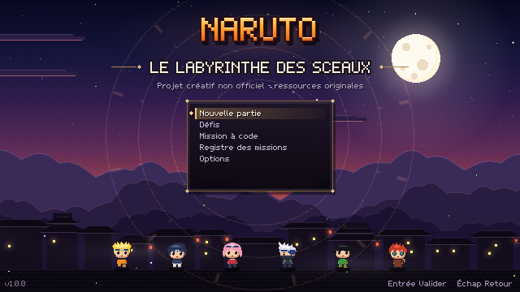 |
| 2 | Sélection | décor du titre assombri, carrousel de 7 silhouettes (verrouillées en ombre et « ? ») avec socle et halo sous le personnage choisi, fiche : statistiques, règle, faiblesse, difficulté ; variante en bas | gauche/droite personnage, haut/bas variante, Y Difficile | sprites de roster, icônes d'actif | 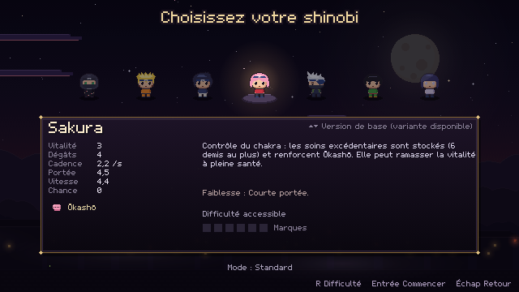 |
| 3 | Salle de combat | HUD en plaques translucides à gauche (actif, santé, ressources, statistiques), carte et étage en haut à droite ; salle 13×7 tuiles au centre, éclairée par ses appliques murales, air du thème | stick gauche déplacement, stick droit tir cardinal | tuiles du thème, ennemis, projectiles | 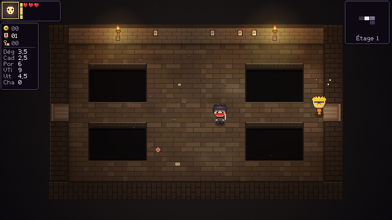 |
| 4 | Bandeau d'étage | chapitre, **nom du lieu**, variante, règle de la variante ; 3,2 s | aucune | police ×2 | 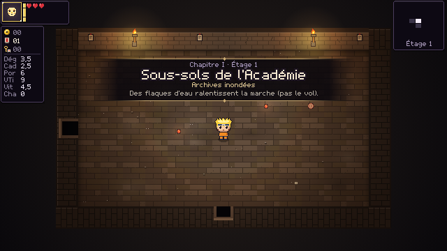 |
| 5 | Intro de boss | bande horizontale, titre et nom, 1,6 s (1,0 s en mode confort) | A accélère | sprite du boss ×2, jingle | 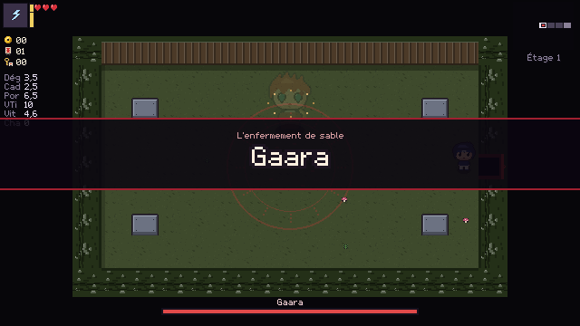 |
| 6 | Combat de boss | barre de vie ornée en bas (traîne claire des dégâts récents), télégraphes au sol, mécanique de phase visible (ici la bande de sable de Gaara) | combat | effets et télégraphes | 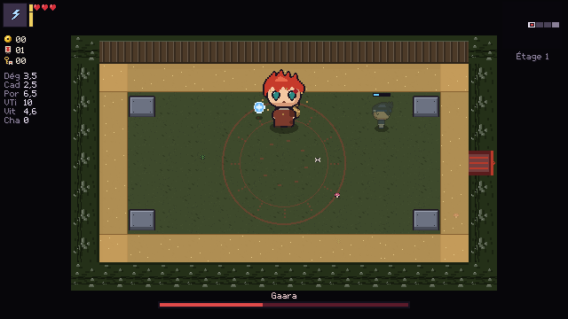 |
| 7 | Pause | menu, portrait et partie (étage, temps, code, mode, objets), statistiques nommées, carte et légende, **chances d'opportunité** et leur détail | haut/bas, A, B pour reprendre | minicarte | 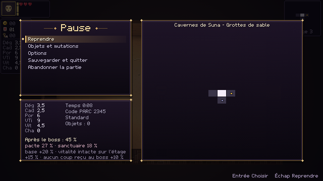 |
| 8 | Objets et mutations | grille d'icônes (actif, talismans, passifs, transformations), fiche détaillée à droite | croix / stick, B | icônes d'objets | 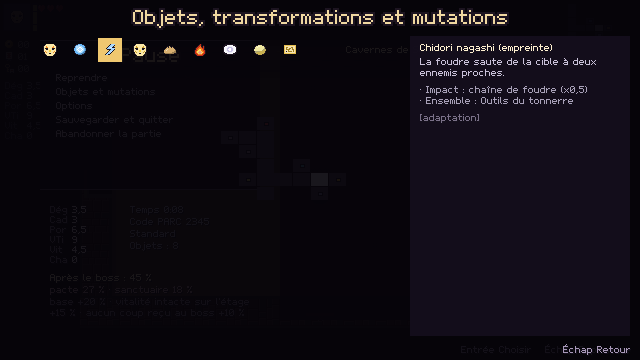 |
| 9 | Échoppe | tapis, étals avec prix, tanuki (offrandes), panneau d'achat au contact | A (interagir) pour acheter ou faire l'offrande | icônes, prix, statue | 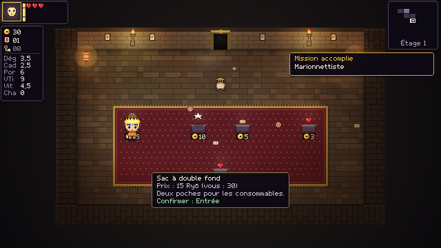 |
| 10 | Pacte | pénombre violette, sceau serpentin, bougies noires, prix en contenants, confirmation si mortel | contact + A (paiement affiché, seconde confirmation si mortel) | décor, statue du serpent | 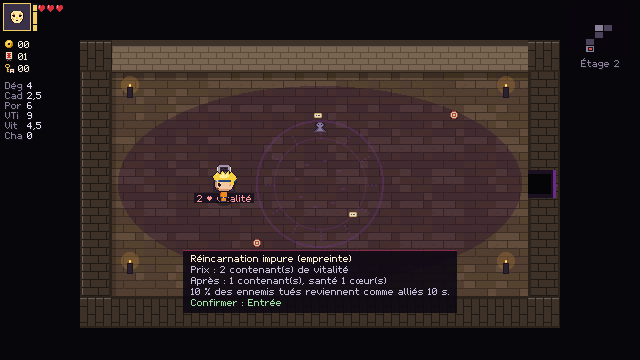 |
| 11 | Sanctuaire | halo doré, corde sacrée, sceau des ermites, statue du crapaud | contact | décor | 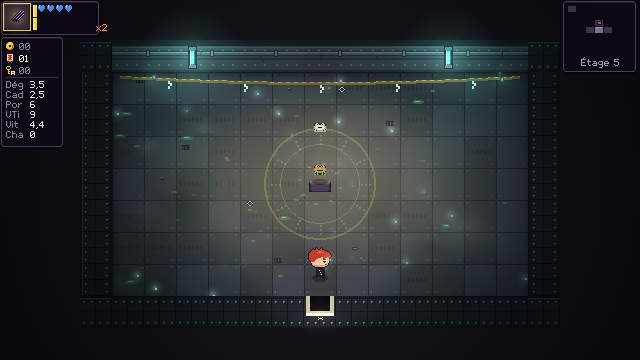 |
| 12 | Autel de tribut | sceau rouge, autel, texte du palier atteint | contact | décor, sons | 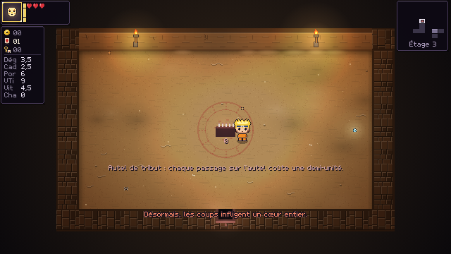 |
| 13 | Registre des missions | 4 onglets (Marques, Collection, Missions, **Secrets**) ; indice puis solution | gauche/droite onglets, haut/bas | police | 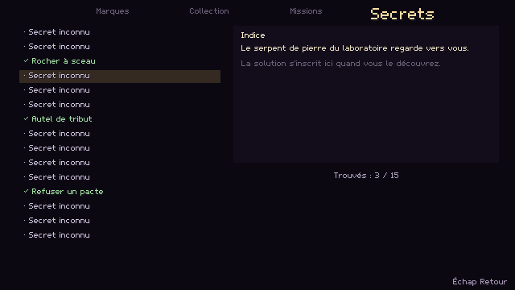 |
| 14 | Options | volumes, vibrations, secousses, sans flash, confort, éclairage dynamique, zones mortes, courbe, visée, commandes, profil | haut/bas, gauche/droite valeurs | — | 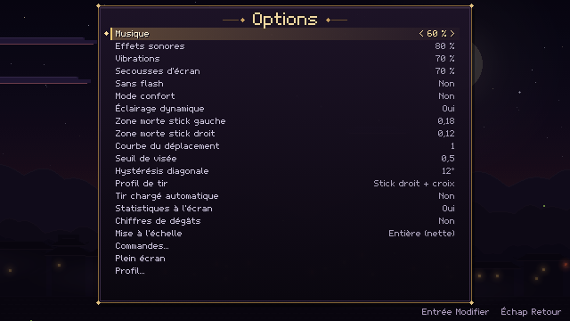 |
| 15 | Mort | cause (source nommée), étage, code, statistiques ; rejouer ou menu | haut/bas, A | — | 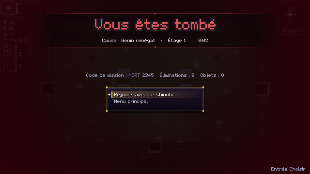 |
| 16 | Victoire | titre de la route, texte original de fin, marque obtenue, récompense de première victoire, temps et code | A | — | 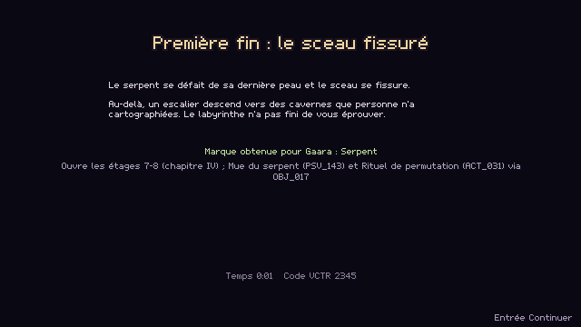 |

**Ressources communes.** Police bitmap du projet (glyphes accentués, œ), palette par thème (D §4), sons synthétisés (D §10), aucune image extraite d'une œuvre existante. **Contraintes vérifiées** : lisible à 640×360 sans zoom, aucune information portée par la seule couleur (icônes de champions, symboles de statuts), zones de texte coupées à la largeur, la ponctuation haute (« : ; ! ? % ») restant attachée au mot précédent.
